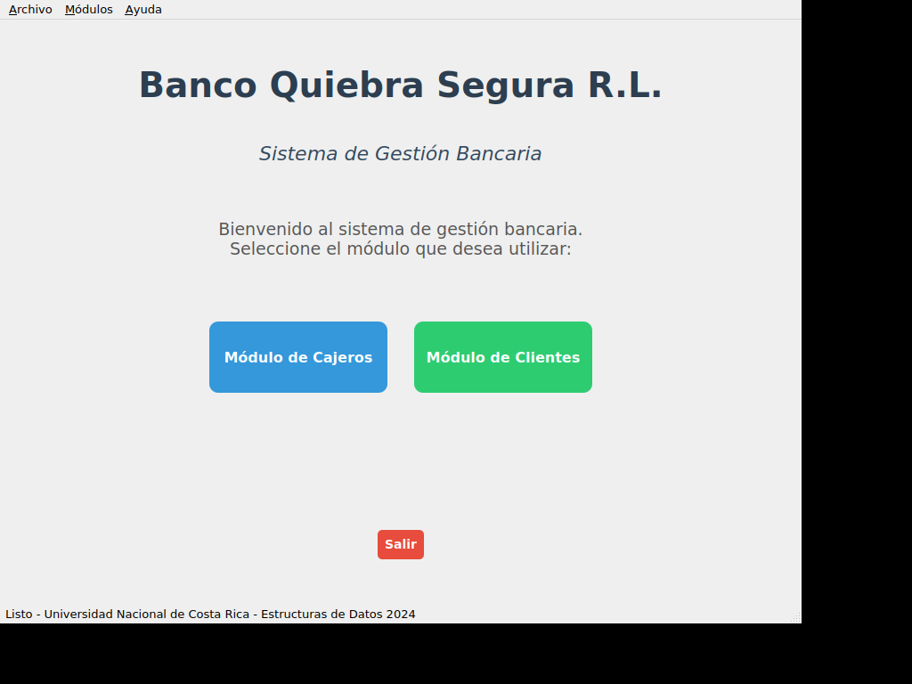

# Sistema Bancario GUI - Banco Quiebra Segura R.L.

## Descripción

Este proyecto ha sido mejorado con una **interfaz gráfica moderna** utilizando Qt5, manteniendo toda la funcionalidad del sistema de consola original.

## Características del Sistema GUI

### Ventana Principal
- **Diseño moderno** con botones grandes y fáciles de usar
- **Navegación intuitiva** entre módulos
- **Menú superior** con atajos de teclado
- **Barra de estado** informativa

### Módulo de Cajeros (GUI)
- **Formulario de entrada** con validación en tiempo real
- **Tabla de cajeros** con selección y edición
- **Operaciones CRUD completas**:
  - Agregar cajeros nuevos
  - Modificar información existente
  - Eliminar cajeros (con confirmación)
  - Actualizar vista automáticamente
- **Validaciones automáticas**:
  - IDs únicos
  - Números de caja únicos (1-6)
  - Máximo 6 cajeros
  - Nombres obligatorios

### Módulo de Clientes (GUI)
- **Gestión de colas visual** con estructura de árbol
- **Sistema de prioridades** automático:
  - Adultos mayores (65+) = Prioridad alta (rojo)
  - Clientes regulares = Prioridad normal (verde)
- **Operaciones disponibles**:
  - Agregar clientes con asignación inteligente de colas
  - Atender clientes (FIFO con prioridades)
  - Eliminar clientes por número de ticket
  - Vista en tiempo real del estado de todas las colas
- **Información detallada**:
  - Estado de cada cajero
  - Número de clientes en cada cola
  - Información completa de cada cliente (ticket, edad, tipo)

## Compilación y Ejecución

### Requisitos
- Qt5 (qtbase5-dev, qtchooser, qt5-qmake, qtbase5-dev-tools)
- Compilador C++ con soporte C++11
- Sistema Linux con servidor X11 (para GUI)

### Compilar
```bash
cd ProyectoEstructuras
qmake BancoGUI.pro
make
```

### Ejecutar
```bash
# Modo GUI
./BancoGUI

# Modo consola (original)
./main
```

## Atajos de Teclado

- **Ctrl+1**: Abrir Módulo de Cajeros
- **Ctrl+2**: Abrir Módulo de Clientes
- **Ctrl+Q**: Salir de la aplicación

## Mejoras Implementadas

### Interfaz Visual
1. **Diseño moderno** con colores corporativos
2. **Botones con efectos hover** y retroalimentación visual
3. **Iconografía intuitiva** mediante colores (verde=agregar, amarillo=modificar, rojo=eliminar)
4. **Layouts responsivos** que se adaptan al tamaño de ventana

### Funcionalidad
1. **Validación en tiempo real** de todos los campos
2. **Mensajes informativos** claros y descriptivos
3. **Confirmaciones de seguridad** para operaciones críticas
4. **Estado visual** del sistema en tiempo real

### Usabilidad
1. **Navegación clara** entre módulos
2. **Formularios auto-completables**
3. **Selección de registros** mediante clicks
4. **Actualización automática** de vistas

## Estructura del Código GUI

```
ProyectoEstructuras/
├── main_gui.cpp          # Punto de entrada GUI
├── mainwindow.h/.cpp     # Ventana principal
├── cajerosdialog.h/.cpp  # Módulo de cajeros GUI
├── clientesdialog.h/.cpp # Módulo de clientes GUI
├── BancoGUI.pro          # Archivo de proyecto Qt
├── Cajero.h/.cpp         # Lógica de negocio (reutilizada)
├── Clientes.h/.cpp       # Lógica de negocio (reutilizada)
└── Librerias.h           # Headers comunes
```

## Capturas de Pantalla



## Tecnologías Utilizadas

- **Lenguaje**: C++11
- **Framework GUI**: Qt5 (Widgets)
- **Estructuras de Datos**: Listas enlazadas
- **Patrón de Diseño**: MVC (Modelo-Vista-Controlador)

## Autor

Desarrollado para Universidad Nacional de Costa Rica - Estructuras de Datos 2024